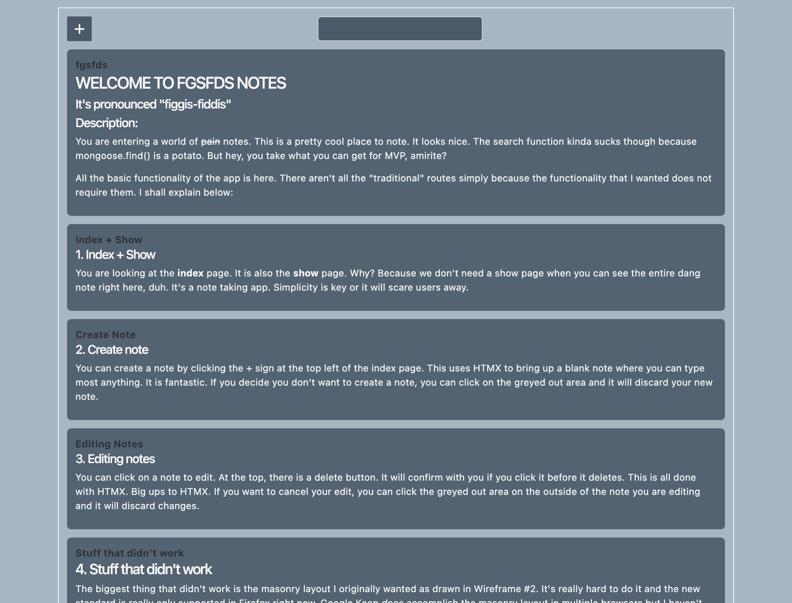
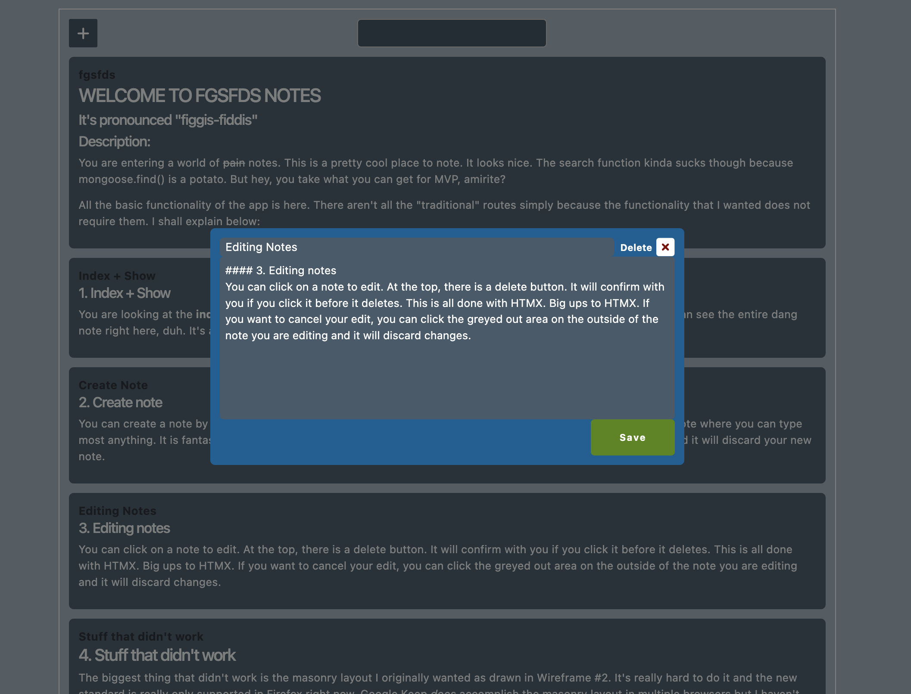

##### Obama loves fgsfds notes. It's pronounced "figgis-fiddis"
# fgsfds-notes
### Description:
*fgsfds is a notetaking app similar to Google Keep in its functionality.*

It is a fullstack CRUD app that connects to MongoDB.

### Technologies Used:
- HTML/CSS/JavaScript
- MongoDB
- **In Node:**
    - express
    - EJS
    - mongoose
    - dotenv
    - morgan
    - method-override
    - markdown-it
    - HTMX
    - nodemon (dev)

~~All~~ *Most* of the basic functionality of the app is here. It also has some fancy stuff in the form of **HTMX** and **markdown-it**.

I didn't have to utilize all of the "traditional" routes simply because the functionality that I wanted does not require them. I shall explain below:

### 1. Index + Show
The **index** page is also the **show** page. Why?
Because we don't need a show page when you can see the entire note right here. It's a note taking app. Simplicity is key or it will scare users away.

### 2. Create note
You can **create** a note by clicking the + sign at the top left of the index page. This uses HTMX to bring up a blank note where you can type most anything. It is fantastic. If you decide you don't want to create a note, you can click on the greyed out area and it will **discard** your new note.

### 3. Editing notes
You can click on a note to **edit**. At the top, there is a **delete** button. It will confirm with you if you click it before it deletes. This is all done with HTMX. Big ups to HTMX. If you want to cancel your edit, you can click the greyed out area on the outside of the note you are editing and it will **discard** changes.

### 4. Stuff that didn't work/stuff I didn't like
The biggest thing that didn't work is the masonry layout I originally wanted as drawn in Wireframe #2. It's really hard to do it and the new standard is really only supported in Firefox right now. Google Keep *does* accomplish the masonry layout in multiple browsers but I haven't the slightest idea how. I think it's probably easier in React or something but we aren't there yet.

The second thing that was hard is the search function. It seems to be really difficult to parse user queries out of a search bar and into mongoose in any meaningful way without a lot of tinkering and effort. The search only works right now if the user searches for the *entire* body string in full. Which is great if you have a note that says just *asdf* but not so good if you wanna search for anything more complex than that.

The third thing is the way that clicking the greyed out area clears the notes. It's still querying the server and receiving a res.send() with nothing in it, but it was the only way I could run the innerHTML that would work and just clear out the div. I tried using a click listener and it wouldn't work

Another thing, I left routes that are unused in the controller/routes files because why not? There is also a new view called **results** that displays search results. More HTMX.
  
---
## Wireframe 1  

<!--    -->
#### Wireframe 1 is what is displayed when a user clicks on an existing note;  
#### the note pops up in an editable window that overlays everything else.  
---
## Wireframe 2  

<!--    -->
#### Wireframe 2 shows how the front page should look.  
#### The notes are displayed, as is a search bar and a button for adding a new note.

---
## Screenshots:

